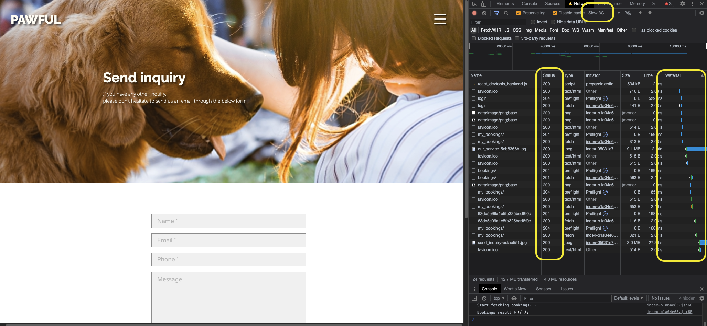
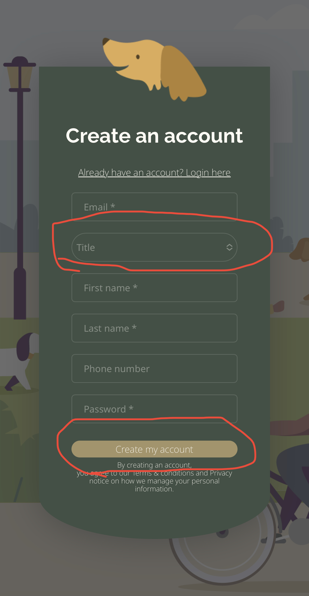
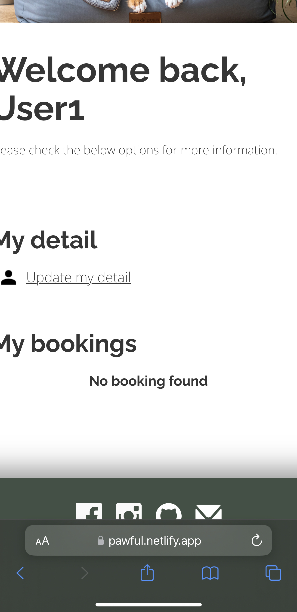
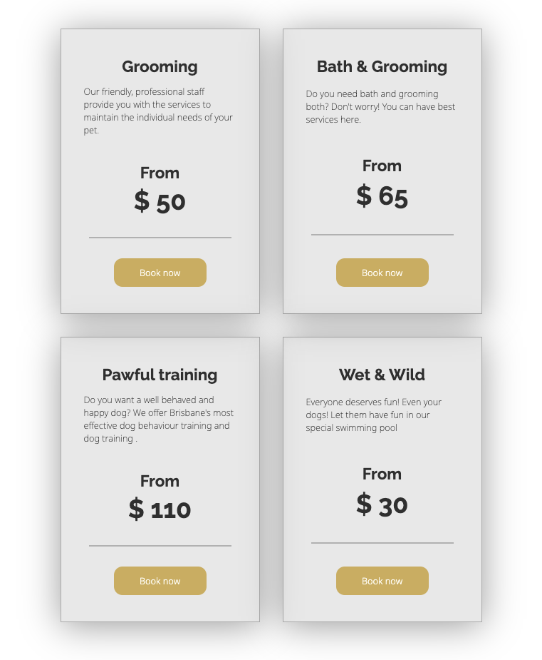
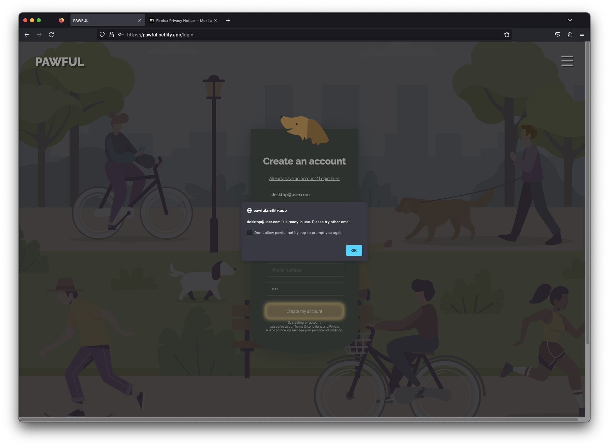
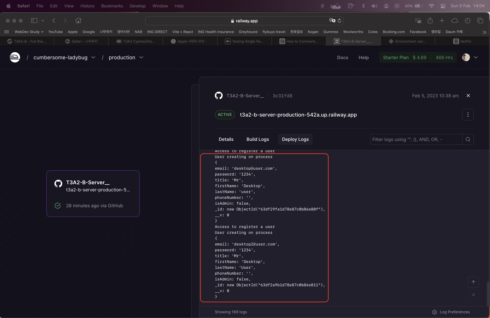
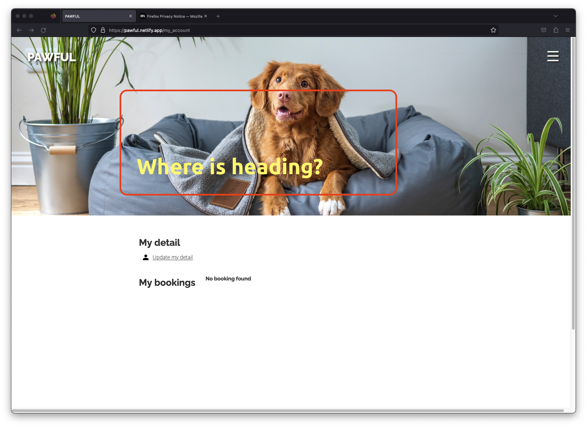

# **Testing**
---------------------------------------------------------------------------------------------------------

# **1. Unit tests**
   - Please refer to the test-codes in ;
     - Backend : `./App.test.js`
     - Frontend : `./test/App.test.jsx`
   - To run tests, run the following command on each server
      ```bash
        npm test
      ```
<br>

### **Back-End Testing**

### **Login and Register**
--------------


### **Get Requests**
--------------


### **Post Requests**
--------------


### **Update Requests**
--------------


### **Delete Requests**
--------------


# **2. Integration & E2E testing**
   - Please refer to the test-codes in ;
     - Frontend : `./cypress/Components.cy.jsx`
   - To run tests, run the following command
     ```bash
      # To run scripts only
      npx cypress run

      # To run the test on screen,
      npx cypress open
      # Select E2E test and click components.cy.jsx
     ```

   - Click here to [watch](!https://youtu.be/_CdhKg2znSA) test running

<br><br>

# **2. Development Tests**

  1. OS compatibility testing
  - Joshua Doigee's OS is Windows, final test has been passed.
  - Chang-Ha Lee's OS is Mac, final test has been passed.
  - iOS : **iOS 12(2018 released) test failed.**, iOS 16 passed.
  - Android : Test skipped

  2. Web Browser compatibility testing
  - Z-index working fails on Firefox, but works on Chrome, Safari and Edge. Refer to User test3, 4
  - General Web Browsers test passed. 

  3. Network test
  - Testing on virtual slow-network. 
  - Can expect how much it'll take until the page rendered and the data's coming back from the server.

  - The hero images used in the web app is the longest waiting time requires. The data and 


<br><br>


# **3. Production Tests**

We have 4 anonymous end users to test this final app.  

The users will have a task to perform, free-navigating and the feedback.

1. Task :  
   1. All users will create an account 
   2. Logout then login back
   3. Change the user details
   4. Create a booking
   5. Modify the booking
   6. Cancel the booking
   7. Free-Navigating
   8. Logout  
  

2. Testing  
   1. User 1 : **Mobile using tester** / Safari 16.1
      1. Feedback : 
       - Mostly good to use. Cute pictures and illustrator.
       - ~~**It was hard to find the booking button from My account page**~~
       - Hotfixed) New booking card added in the page of My account
       - on iPhone, the select box and the button have different shapes compared to regular input boxes.
       -  
       - After login, the screen does not fit in the screen size.
       -  
<br><br><br>

   1. User 2 : Tablet tester and **very old device(expecting delayed communication from client to API server)  / _Chrome 92.0_**
      1. Feedback :
         - ## **All task failed**
         - Can't access to the Web Application at all 
         - Needs notice for warning messages for minimum browser version
<br><br><br>

   1. User 3 : Laptop tester / Chrome 109.0.1  
      1. Feedback :  
         - Enter not working on login, had to click the button
         - ~~Package cards looks dusty~~ Hotfixed
         -  
<br><br><br>

   1. User 4 : Desktop user / Firefox 109.0.1  
      1. Feedback : 
         - Join caused error after submit. It turned out that the account made and error received. 2 times tried, 2 times failed
         -  
         -  
         - Hero image is rendered upon heading
         - **Commented : happens on Firefox only, seems like Firefox bug**
         -   
         - Would be better if outisde of menu clicked, the hamburger menu goes away
 <br><br><br>

   

