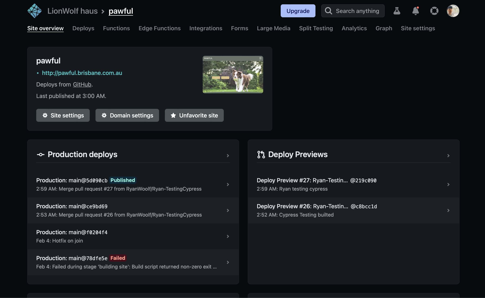
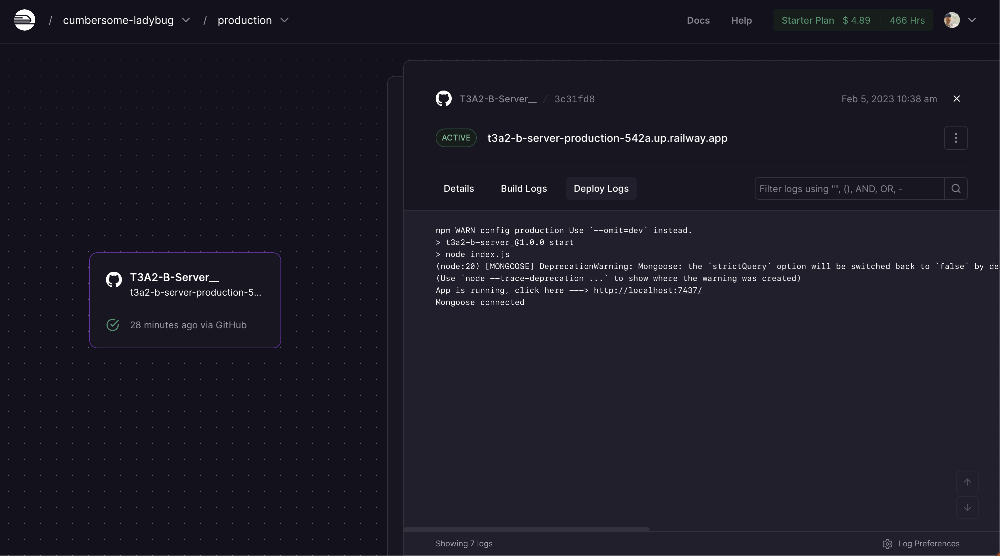
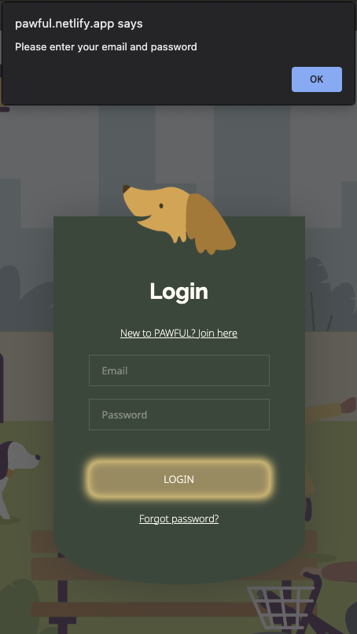
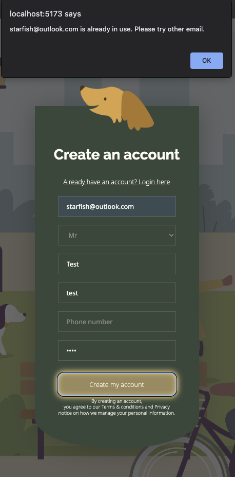
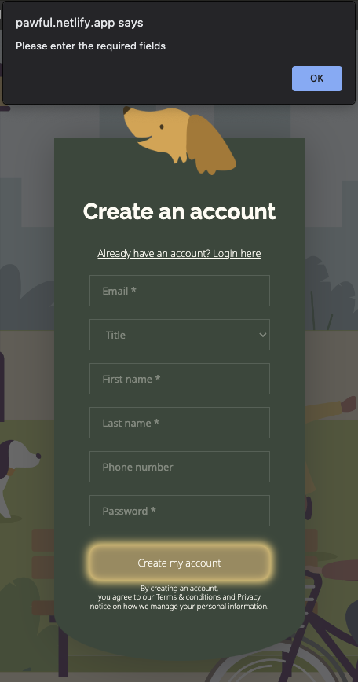
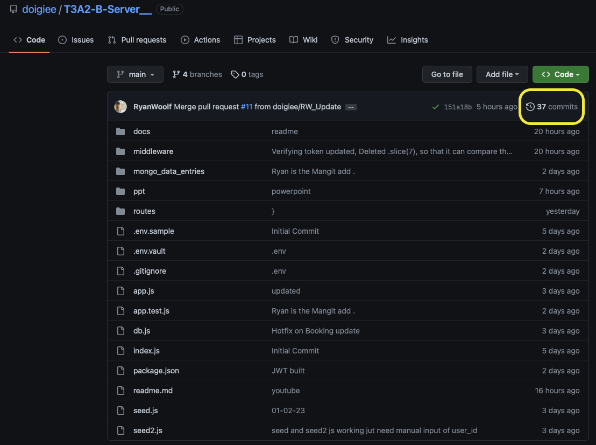
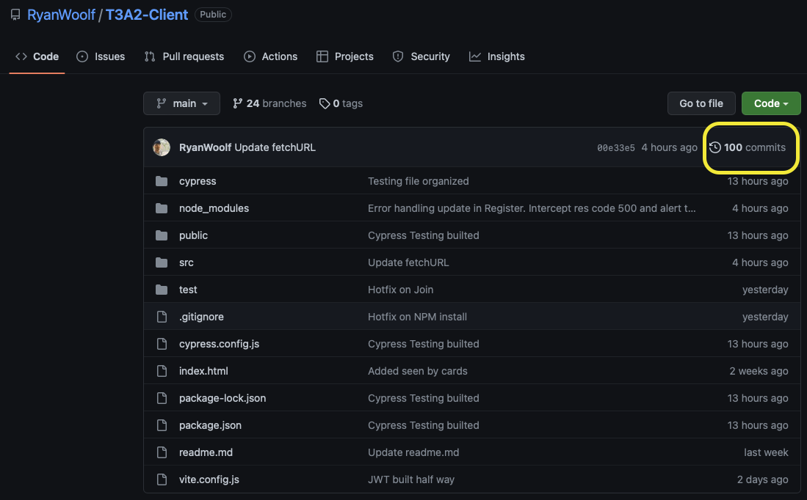

<div style="text-align:center">
<br><br>
 <br><br>
<h1 style="font-weight:700"> PAWFUL </h1>
</div>


------
### **Repositories**
- [**Part A**](https://github.com/doigiee/T3A2)  
- [**Part B - API Server**](https://github.com/doigiee/T3A2-B-Server__)  
- [**Part B - Client**](https://github.com/ryanwoolf/T3A2-Client)  


---------------------------------------------------------------------------------------------------------

### **Collaborators**

- [**Jordyn Small**](https://github.com/JanzenCode)
- [**Joshua Doig**](https://github.com/doigiee)
- [**Ryan Chang-Ha Lee**](https://github.com/RyanWoolf)

---------------------------------------------------------------------------------------------------------
### **Helpful links**

- [PAWFUL](https://pawful.netlify.app/)  
- [Trello Board](https://trello.com/invite/b/eWwKHnN0/ATTI3f78610d0c10e4d694ad3163526c3e6bAB3FD434/doggy-playground-web-app) 
- [Presentation](https://www.youtube.com/watch?v=JTOWHwUrmpg) 


----------------------------------------------------------------
### **Index**
- [Installation](#installation)
- [Deployment](#deployment)
- [Delegation](#delegation)
- [Demonstration](#demonstration)
- [Libraries](#libraries)
- [Error handling](#error-handling)
- [Testing](#testing)
- [Source control](#source-control)
- [Trello screenshots](#trello-screenshots)
  
----------------------------------------------------------------
## **Installation**
----------------------------------------------------------------
### **1. Backend Server**  
  
Git clone here: [Backend - Server API](https://github.com/doigiee/T3A2-B-Server__)  
<br>
Firstly run `npm init -y`, and `npm i express` then run `npm start` or `nodemon` to get the Server running. 

### **Before nodemon, make sure setting up for `ATLAS_DB_URL` and `SECRET_KEY` in .env file**


make a DB with Mongo DB. 
    
    1. create a user/account  then sign in 
    2. create a cluster as a free user and install the extension in vs code 'MongoDB for VScode'. 
    3. then create a database and seed it with the needed users entries by running the files in the following order by pressing the play button in the top right conner of each file
        - 'src/mongoDB_data_entries/1. create_users_database.mongodb'         
        - 'src/mongoDB_data_entries/2. create_bookings_database.mongodb'
        - 'src/mongoDB_data_entries/3. user_entries.mongodb'
  
 Disclaimer: before doing step 4, make sure to uncomment 'user' for each entry and manually copy and paste over the id of the newly created user_id from MongoDB. Once done you will be able to seed and connect the users to bookings. And do so by pressing the play button for the following file.
        - 'src/mongoDB_data_entries/4. booking_entries.mongodb'
    4. then create a .env file in the root of the project and  fill in the ATLAS DB connection string in the .env file, a sample file has been provided.

or alternatively to step 3, run `node seed.js` once your database 'PAWFUL' is created and connected with the 2 needed collections(can use `mongo_data_entries/1. create_users_database.mongodb` then `mongo_data_entries/2.createbookings_database.mongodb`) this will create 2 collections 'users' and 'bookings'. then do and `node seed.js`, in terminal, to seed users collection. Then manually insert the user_id from the ids created in users into `node seed2.js` to creating bookings which relate to your newly created users, as `users[2]._id` didn't work unfortunately. If followed correctly this will create some default entries into our DB's 'users' and 'bookings' collections.


Below are documentation and proof of user testing and the API endpoints as well as showing that our deployed application is fully tested. We obviously ran this code and did this kinda of manual testing 1000 times over but here are demonstrations of each kind of user testing which we did.

### **2. Frontend**  
  
Git clone here: [Frontend](https://github.com/RyanWoolf/T3A2-Client) 
<br>

After clone or pull the repository, Try below
```
npm install
```

if you face an error on dev-packages, please try below

```
npm install --force
```

After successfully installing packages, 
you can run the following command to start server

```
npm run dev
```

After you see the below message, it's ready to start
```bash
> t3a2-client@0.0.0 dev
> vite


  VITE v4.0.4  ready in 275 ms

  ➜  Local:   http://localhost:5173/
  ➜  Network: use --host to expose
  ➜  press h to show help
```
<br><br><br>

## **Delegation**
----------------------------------------------------------------

This is the very first of team projects for all of collaborators.
We have assigned each task based on their interests and the grades from last couple of other assignments. 

**Joshua** : Backend server and documentation  
- Has strength on idea and concept about what and how to implement of this project database. 
- Wasn't confident on visualization ideas.

**Ryan Chang-Ha Lee** : Frontend, Graphic design and visualization  
- Has strength on visualizing part such as Graphic design concept and development. He's strongly interested in Frontend design.
- Has a bit of lack on API server. 

**Jordyn Small** : General tasks


Each tickets from Trello based on `Kanban` project methodology has been picked up by each collaborators voluntarily but the due dates have been determined through many times of discussions in the team.

Please refer to 


<br><br><br>

## **Deployment**
----------------------------------------------------------------
### **Frontend**
Address : https://pawful.netlify.app/  
Hosting : Netlify  
  

### **Backend**
Address : http://t3a2-b-server-production-542a.up.railway.app/  
Hosting : Railway    
 

<br><br><br>

## **Libraries**
--------------------------------------
### Click [here](./docs/libraries.md) to see Libraries explanation


<br><br><br>


## **Demonstration**
### **Homepage**
--------------


### **Booking**
--------------
**The pictures below demonstrates how easy it is made to choose one of the selected time for their booking.**


### **Create Account**
--------------
**As simple as an email, title, name, phone number and password to get started. And very easy in user settings to update and change personal information as well!!**


### **Login**
--------------


### **Inquiry**
--------------


<br><br><br>


## **Error handling**
--------------

### Client

1. Custom 404 page

- Any routes doesn't match in the web-app. 
- **Netlify** have their own error handling page. Needed small setup to intercept the customized error handling page  

  
2. Login errors
   
- 1. If the information the user entered is not matched or API server is down


- 2. When the user tries to login without an email or password


3. Register

- 1. Email is already used


- 2. Tries to proceed without the minimum required inputs



### API server  


<br><br><br>

## **Testing**
--------------------------------------
### Click [here](./docs/testing.md) to see Testing report


<br><br><br>

## **Source control**
--------------------------------------

1. Backend commits. See [here](https://github.com/doigiee/T3A2-B-Server__/commits/main) to see the full commits  


2. Frontend commits. See [here](https://github.com/RyanWoolf/T3A2-Client/commits/main) to see the full commits  



<br><br><br>

## **Trello Screenshots**
--------------------------------------

### **Our team is following `Kanban` project methodology to perform high task efficiency according to their ability and circumstances.**

### Click [here](./docs/trello.md) to see Trello Screenshots


<br><br><br>
